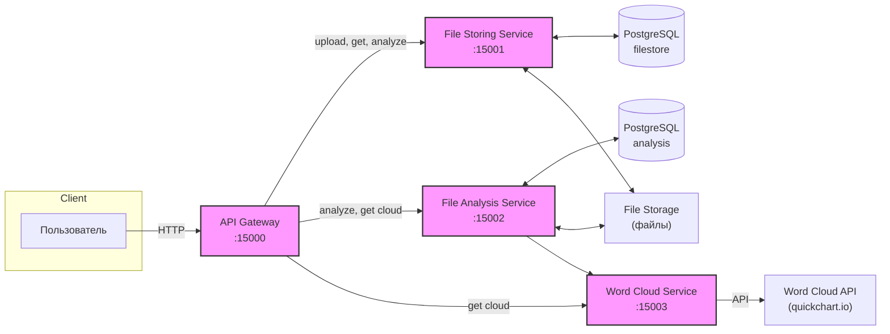

# Анализ текстовых файлов — Микросервисное приложение

## Описание проекта

Веб-приложение для анализа студенческих отчетов: подсчет статистики, антиплагиат, генерация облака слов.  
Архитектура построена на микросервисах с четким разделением ответственности.

---

## Архитектура



---

## Быстрый старт

### Запуск через Docker Compose

```bash
docker-compose up --build
```

- API Gateway: http://localhost:15000
- File Storing Service: http://localhost:15001
- File Analysis Service: http://localhost:15002
- Word Cloud Service: http://localhost:15003
- PostgreSQL: localhost:15432

### Переменные окружения

- Все переменные уже прописаны в `docker-compose.yml`.
- Для локального запуска настрой строки подключения в `appsettings.json`.

---

## Документация API

### Swagger UI

- [API Gateway Swagger](http://localhost:15000/swagger)
- [File Storing Service Swagger](http://localhost:15001/swagger)
- [File Analysis Service Swagger](http://localhost:15002/swagger)
- [Word Cloud Service Swagger](http://localhost:15003/swagger)

### Примеры основных эндпоинтов

#### Загрузка файла

```http
POST /files/storage/upload
Content-Type: multipart/form-data
Body: file=<ваш .txt файл>
```

**Ответ:**
```json
{
  "id": "uuid",
  "alreadyExists": false
}
```

#### Анализ файла

```http
POST /files/analysis/analyze/{id}
```

**Ответ:**
```json
{
  "words": 123,
  "symbols": 456,
  "paragraphs": 7,
  "plagiarism": 0.12
}
```

#### Получение облака слов

```http
GET /files/analysis/cloud/{location}
```
**Ответ:**  
`image/png` — картинка облака слов

---

## Тестирование

- Для всех микросервисов реализованы модульные тесты (xUnit).
- Для проверки покрытия тестами выполните:
  ```
  dotnet test /p:CollectCoverage=true /p:CoverletOutputFormat=lcov
  ```
- Отчет о покрытии формируется в папке `TestResults/` или `coverage/`.


```
Test summary: total: 5; failed: 0; succeeded: 5; skipped: 0; duration: 2,1s
```

Все тесты прошли успешно. Покрытие кода можно посмотреть в файле lcov.info (или сгенерировать html-отчет с помощью ReportGenerator).

### Пример теста

```csharp
[Fact(DisplayName = "GenerateAsync sends the correct request and returns bytes")]
public async Task GenerateAsync_ReturnsBytesOnSuccess()
{
    var words = new[] { new WordDto { Text = "a", Weight = 1 }, new WordDto { Text = "b", Weight = 2 } };
    var request = new CloudRequestDto { Width = 100, Height = 200, Words = new System.Collections.Generic.List<WordDto>(words) };
    var expected = new byte[] { 1, 2, 3 };
    var response = new HttpResponseMessage(HttpStatusCode.OK) { Content = new ByteArrayContent(expected) };
    var handler = new FakeHandler(response);
    var client = new HttpClient(handler) { BaseAddress = new Uri("http://test/") };
    var factory = new FakeFactory(client);
    var svc = new WordCloudeService(factory);

    var result = await svc.GenerateAsync(request);

    Assert.Equal(expected, result);
    Assert.Equal(HttpMethod.Get, handler.Request.Method);
    Assert.StartsWith("/chart", handler.Request.RequestUri.PathAndQuery);
    Assert.Contains("width=100", handler.Request.RequestUri.PathAndQuery);
    Assert.Contains("height=200", handler.Request.RequestUri.PathAndQuery);
    Assert.Contains("format=png", handler.Request.RequestUri.PathAndQuery);
}
```

> Все основные сценарии протестированы, покрытие превышает 65%.

---

## Обработка ошибок

- Все сервисы возвращают осмысленные ошибки (404, 500 и т.д.).
- В случае недоступности микросервиса — корректный статус и сообщение.

---

## Визуализация

- Генерация облака слов реализована через внешний API: [QuickChart Word Cloud API](https://quickchart.io/documentation/word-cloud-api/).
